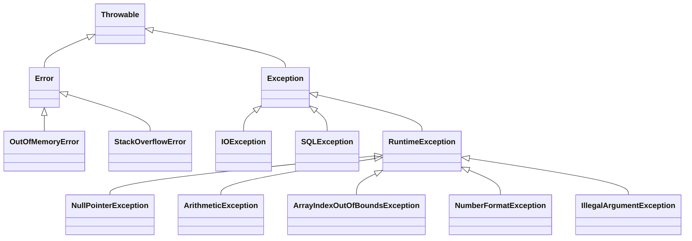

# Exception and Files

---

# 📑 Table of Contents

1. Introduction to Exceptions
2. Types of Exceptions
3. Exception Hierarchy
4. Handling Exceptions
   - try block
   - catch block
   - finally block
5. Throw and Throws
6. Custom (User-Defined) Exceptions

---

## 1. Introduction to Exceptions

In programming, we usually expect our code to run **step by step without problems**. However, in real life, things do not always go as planned. When something unexpected happens during the execution of a program, Java creates an **exception**.

An **exception** is an event that **interrupts the normal flow of a program**. Instead of the program crashing immediately, Java gives us a chance to **handle the problem properly**.

In Java, exceptions are treated as **objects**. This means they contain information about:
- What went wrong
- Where the error occurred
- A message describing the problem

Exceptions usually happen at **runtime**, when the program is already running.

### Why exceptions are important
Exceptions help developers:
- Detect errors early
- Prevent the program from crashing
- Display meaningful error messages
- Keep the application stable and secure

Think of a program like a road trip:
- The normal flow is driving straight to your destination
- An exception is like a roadblock or accident
- Exception handling is taking a **detour** (alternative path/different route) instead of stopping the trip completely

### Common examples of exceptions
- **Dividing by zero** → A mathematical operation that is not allowed
- **Converting a String to a number** → The text does not contain a valid numeric value
- **Invalid array index** → Trying to access an element that does not exist in the array
- **Missing file** → The program expects a file, but the file cannot be found
- **Database connection error** → Unable to connect to the database
- **Network error** → Problems with internet or server communication

> Without exception handling, these problems would cause the program to **stop running immediately**.  
> This means the application would terminate unexpectedly, and the user would not be able to continue using it.

### Advantages of Exception Handling

- **Prevents application crashes**  
  The program can handle errors safely instead of stopping suddenly.

- **Improves code readability**  
  Error-handling code is separated from normal logic, making the program easier to understand.

- **Improves program reliability**  
  The application continues running even when unexpected problems occur.

- **Provides meaningful error messages**  
  Users and developers can understand what went wrong and why.

- **Helps with debugging and maintenance**  
  Exceptions make it easier to locate and fix errors in the code.

- **Improves user experience**  
  Users see friendly messages instead of the application closing unexpectedly.

---

## 2. Types of Exceptions

Java exceptions are divided into **three main categories** based on when they occur and how they should be handled.

### Checked Exceptions

Checked exceptions are exceptions that **happen during program execution but are checked by the compiler at compile time**.  
Java requires the programmer to **handle these exceptions before running the program**.

If a checked exception is not handled, the program **will not compile**.

Checked exceptions force developers to **think about possible problems in advance**, making programs safer and more reliable.

#### Key points:
- Checked at **compile time**
- Must be handled using `try-catch` or declared using `throws`
- Usually related to **external resources** such as files, databases, or networks

#### Why they exist:
Checked exceptions ensure that programmers **do not ignore important problems**, such as missing files or failed database connections.

#### Examples (Compile-time error)

The following code will not compile because file and database operations throw checked exceptions that must be handled.

```java
void main(){

   // File not found (IOException)
   BufferedReader reader = Files.newBufferedReader(Paths.get("dir/lastnames.txt"));

   // Database connection error (SQLException)
   DriverManager.getConnection("jdbc:mysql://localhost:3306/mydb", "user", "password");
}
```
> File and database operations depend on **external resources** that may not always be available.  
> Because these problems can happen outside the program’s control, Java marks them as **checked exceptions** to force the programmer to handle them.


---
### Unchecked Exceptions

Unchecked exceptions are exceptions that **occur during program execution and are not checked by the compiler at compile time**.  
They usually happen because of **programming mistakes** or invalid input.

Java does **not force** the programmer to handle unchecked exceptions, so the program can compile even if they are not handled.  
However, if they occur at runtime, the program may **stop running unexpectedly**.

Unchecked exceptions help developers **identify bugs in the code** that should be fixed rather than ignored.

#### Key points:
- Occur at **runtime**
- Not checked at compile time
- Subclasses of `RuntimeException`
- Usually caused by logic errors or invalid input

#### Why they exist:
Unchecked exceptions indicate **problems in the program logic**, such as using a variable incorrectly or assuming input is always valid.

---

#### Examples (Runtime error)

The following code **compiles successfully**, but may throw an unchecked exception **while the program is running**.

```java
void main() {

    // NullPointerException
    String name = null;
    System.out.println(name.length());

    // ArithmeticException
    int result = 10 / 0;

    // ArrayIndexOutOfBoundsException
    int[] numbers = {1, 2, 3};
    System.out.println(numbers[5]);
}
```

> Unchecked exceptions usually happen because of mistakes in the code,  
> and they should be fixed by correcting the program logic.

---

### Errors

Errors are **serious problems that occur during program execution** and are usually caused by the **Java Virtual Machine (JVM)** rather than the application code itself.

They represent conditions that are **beyond the control of the program**, and most applications **should not try to handle them**.

When an error occurs, the program usually **cannot continue running normally** and may need to be restarted or the system fixed.

#### Key points:
- Occur at **runtime**
- Caused by **system-level or resource problems**
- Not meant to be handled using `try-catch`
- Usually indicate critical failures

#### Why they exist:
Errors indicate **serious problems in the system environment**, such as memory shortages or infinite recursion, that cannot be safely recovered from by the application.

---

#### Examples

The following situations can cause errors during program execution:

```java
void main() {

    // StackOverflowError (infinite recursion)
    recursiveMethod();
}

void recursiveMethod() {
    recursiveMethod();
}
```

```java
// OutOfMemoryError
int[] largeArray = new int[Integer.MAX_VALUE];
```

> Errors usually require fixing the program design, increasing system resources,  
> or restarting the application, rather than handling them in code.

---

### Summary

- **Checked Exceptions** → Must be handled, checked at compile time
- **Unchecked Exceptions** → Runtime errors caused by code issues
- **Errors** → Serious system problems, not recoverable by the program

---

## 3. Exception Hierarchy

The **exception hierarchy** in Java shows how different exceptions and errors are related to each other.  
All exceptions and errors in Java are subclasses of the **`Throwable`** class.




### `Throwable`
`Throwable` is the **root class** of the hierarchy.  
Only objects that extend `Throwable` can be **thrown** or **caught** in Java.

From `Throwable`, Java divides problems into two main branches:

---

### `Exception`
`Exception` represents **conditions that a program can usually handle**.  
Most application-level problems fall under this category.

- Includes both **checked** and **unchecked** exceptions
- Used to signal problems that occur during normal program execution

#### Checked Exceptions
- Subclasses of `Exception` (excluding `RuntimeException`)
- Must be handled at **compile time**
- Examples: `IOException`, `SQLException`

#### `RuntimeException` (Unchecked Exceptions)
- Subclass of `Exception`
- Occur at **runtime**
- Usually caused by programming mistakes
- Not required to be handled by the compiler

Common examples:
- `NullPointerException` → Using a null object
- `ArithmeticException` → Dividing by zero
- `ArrayIndexOutOfBoundsException` → Invalid array index
- `NumberFormatException` → Invalid string-to-number conversion
- `IllegalArgumentException` → Invalid method argument

---

### `Error`
`Error` represents **serious problems** that are **outside the control of the application**.  
These are usually caused by the Java Virtual Machine (JVM).

- Applications should **not attempt to handle** errors
- Often indicate system or memory failures

Common examples:
- `OutOfMemoryError` → JVM runs out of memory
- `StackOverflowError` → Too many nested method calls

---

## 4. Handling Exceptions

Java provides a structured way to handle runtime problems using the **try-catch-finally** mechanism.  
Instead of letting the program stop when an error occurs, Java allows the developer to **detect, handle, and recover** from exceptions.

Exception handling helps keep the application **stable**, **user-friendly**, and **safe**.

---

### try block

The `try` block contains **code that may cause an exception**.  
Java monitors this block, and if an exception occurs, the normal execution stops and control is passed to the `catch` block.

```java
try {
    int result = 10 / 0;
}
```

In this example, dividing by zero causes an `ArithmeticException`.

---

### catch block

The `catch` block is used to **handle the exception**.  
It runs only if an exception occurs in the corresponding `try` block.

```java
catch (ArithmeticException e) {
    System.out.println("Cannot divide by zero");
}
```

- `ArithmeticException` specifies the type of exception to handle
- `e` is the exception object that contains error details

### finally block

The `finally` block contains code that **always executes**, whether an exception occurs or not.  
It is commonly used for **cleanup tasks** such as closing files or releasing resources.

```java
finally {
    System.out.println("Execution completed");
}
```

### try-with-resources

The **try-with-resources** statement is a special form of the `try` block used to **automatically close resources** such as files, streams, or database connections.

Resources declared inside the `try` statement are **closed automatically**, even if an exception occurs.  
This reduces the need for a `finally` block.

```java
void main() {
    try (BufferedReader reader =
                 Files.newBufferedReader(Paths.get("dir/lastnames.txt"))) {

        String line = reader.readLine();
        System.out.println(line);

    } catch (IOException e) {
        System.out.println("Error reading file");
    }
}
```

#### Why use try-with-resources?
- Automatically closes resources
- Reduces boilerplate code
- Prevents resource leaks
- Makes code cleaner and safer

---

### Execution flow summary
- If no exception occurs → `try` → `finally`
- If an exception occurs → `try` → `catch` → `finally`
- If **try-with-resources** is used → resources are **closed automatically**, then `catch` (if needed) executes

> The `finally` block is guaranteed to run in most cases, making it ideal for cleanup operations.  
> In try-with-resources, the resource is closed automatically, so a `finally` block is usually not required.


---

## 5. Throw and Throws

Java provides two keywords, **`throw`** and **`throws`**, to work with exceptions.  
Although they sound similar, they are used for **different purposes**.

---

### throw

The `throw` keyword is used to **explicitly throw an exception** in the code.  
It is usually used when the programmer wants to **signal an error condition manually**.

- Used **inside a method or block** to enforce business rules
- Used to signal **logical or business-related errors**, not system failures
- Helps make the application **more logical, predictable, and easier to maintain**
- Commonly used for **input validation and rule checking**


```java
if(name == null || name.isBlank()){
        throw new IllegalArgumentException("Name cannot be null or empty");
}

if (amount <= 0) {
        throw new IllegalArgumentException("Amount must be greater than zero");
}
```

> `throw` is used when you decide that something is wrong and want to stop normal execution.

---

### throws

The `throws` keyword is used in a **method declaration** to indicate that the method **does not handle an exception itself**, but instead **passes the responsibility to the caller**.

It is commonly used when a method **cannot reasonably decide how to handle the problem**, such as when working with files, databases, or networks.

#### Key points:
- Used in the **method signature**
- Can declare **multiple exceptions**
- Mostly used with **checked exceptions**
- Shifts error-handling responsibility to the calling method

#### Real-world example (business-friendly)

```java
public void loadCustomerFile(String path) throws IOException {
    BufferedReader reader = Files.newBufferedReader(Paths.get(path));
    // read and process file
}
```

In this example:
- The method’s job is **only to read customer data**
- It does not decide what to do if the file is missing
- The **caller decides** whether to retry, show a message, or stop the process

```java
try {
    loadCustomerFile("customers.txt");
} catch (IOException e) {
    System.out.println("Customer file could not be loaded");
}
```

> `throws` helps keep code **clean and well-structured** by separating **business logic** from **error-handling logic**.


- **`throw`** → actually throws an exception
- **`throws`** → declares that an exception may occur

---

## 6. Custom (User-Defined) Exceptions

Custom exceptions are exceptions **created by the programmer** to represent **specific business or application rules** that are not covered by Java’s built-in exceptions.

They make the code **more meaningful, readable, and easier to maintain**, because the exception name clearly describes what went wrong.

---

### Why use custom exceptions?

Built-in exceptions like `IllegalArgumentException` are generic.  
Custom exceptions allow us to express **business-specific problems** clearly.

Examples:
- A bank account does not have enough balance
- An order exceeds the allowed limit
- A user is not authorized to perform an action

---

### Example: Custom Exception Class

```java
public class InsufficientFundsException extends Exception {
    private Double balance;
    private Double amount;
    
    public InsufficientFundsException(String message, Double balance, Double amount) {
        super(message);
        this.balance = balance;
        this.amount = amount;
    }
    
    public InsufficientFundsException(String message) {
        super(message);
    }
    
    // Getter / Setter methods
    // Other methods
    
    @Override
    public String toString() {
        return "Insufficient funds: balance = " + balance + ", amount = " + amount;
    }
}
```

In this example:
- `InsufficientFundsException` represents a **business rule violation**
- It extends `Exception`, making it a **checked exception**
- The message explains the problem clearly

---

### Using the custom exception

```java
public void withdraw(double amount) throws InsufficientFundsException {
    if (amount > balance) {
        throw new InsufficientFundsException("Not enough balance in account", balance, amount);
    }
    balance -= amount;
}
```

Here:
- The exception is thrown when a **business rule is broken**
- The method remains clean and focused on its logic
- Error handling is left to the caller

---

### Why this improves application design

- Makes business rules **explicit**
- Improves code readability
- Separates **business logic** from **error handling**
- Helps developers understand the problem faster

> Custom exceptions allow us to describe business errors clearly instead of using generic exceptions.
